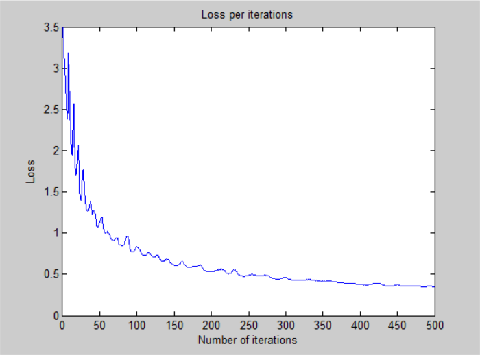
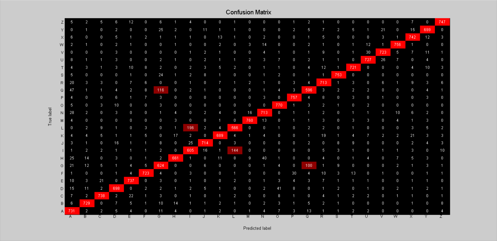

# Deeper Neural Network - v1

## Architecture:

- 1 input layer (784 units)
- 1 hidden layer (1024 units, relu activation)
- 1 hidden layer (128 units, relu activation)
- 1 output layer (26 units, softmax activation)

## Training time: 

- 500 iterations for ~2h 12 minutes (CPU)
- 15.84s per iteration on average

## Loss:

- 3.442659e-01 -- Categorical Cross-Entropy Loss

## Accuracy:

- 90.19 % -- Training accuracy
- 88.42 % -- Test accuracy

