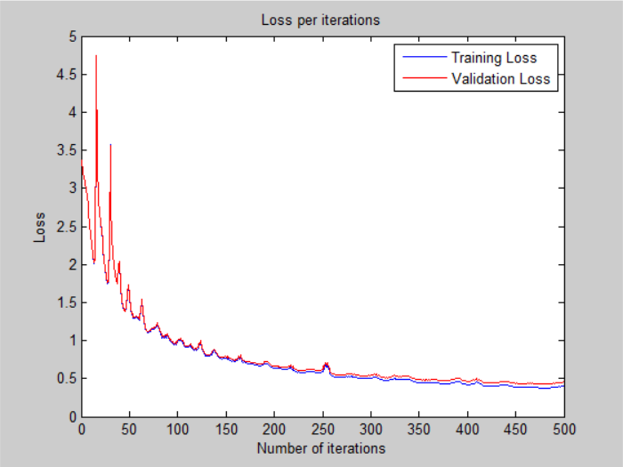
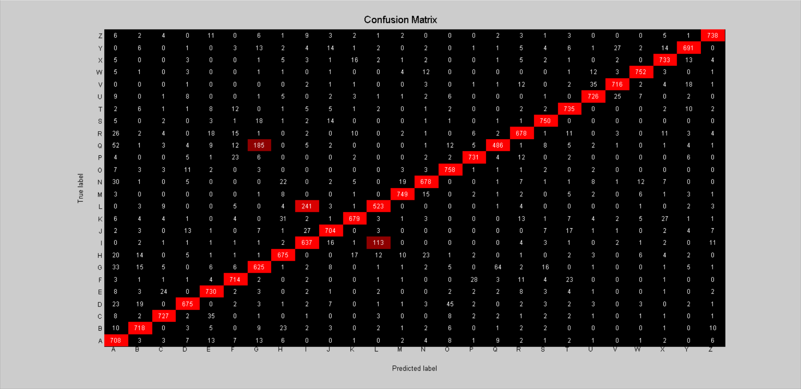

# Deeper Neural Network - v1

## Architecture:

- 1 input layer (784 units)
- 1 hidden layer (512 units, relu activation)
- 1 hidden layer (64 units, relu activation)
- 1 output layer (26 units, softmax activation)

## Loss:

## Accuracy:

- 88.46 % -- Training accuracy
- 86.85 % -- Validation accuracy
- 86.71 % -- Test accuracy

