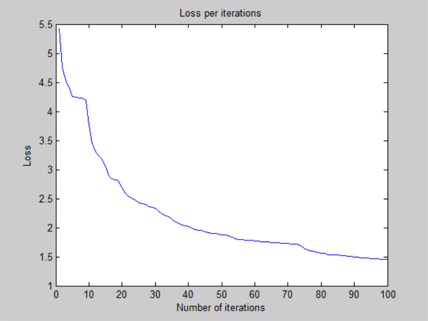
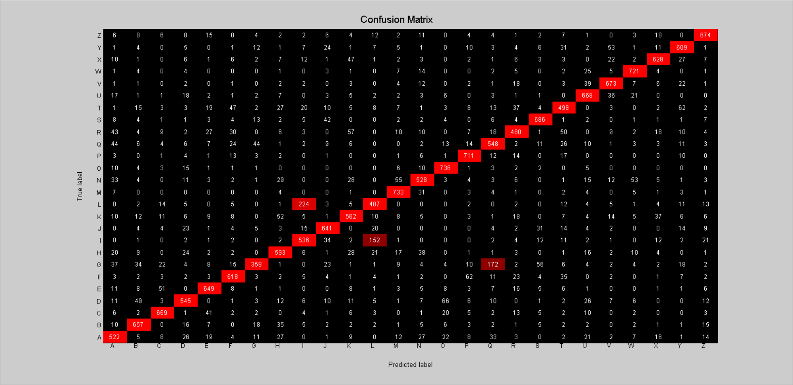

# Deeper Neural Network - v1

## Architecture:

- 1 input layer (784 units)
- 1 hidden layer (256 units, sigmoid activation)
- 1 hidden layer (256 units, sigmoid activation)
- 1 output layer (26 units, sigmoid activation)

## Training time: 

- 100 iterations for ~28 minutes (CPU)
- 16.8s per iteration on average

## Loss:

- 1.456006e+00 -- Binary Cross-Entropy Loss

## Accuracy:

- 75.88 % -- Training accuracy
- 75.63 % -- Test accuracy

