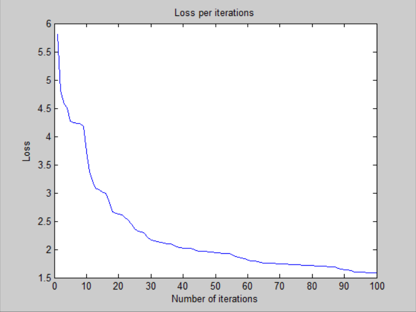
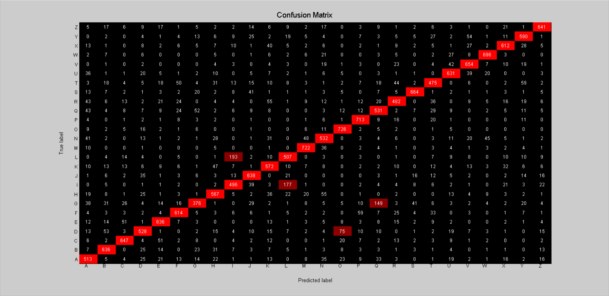

# Deeper Neural Network - v1

## Architecture:

- 1 input layer (784 units)
- 1 hidden layer (512 units, sigmoid activation)
- 1 hidden layer (512 units, sigmoid activation)
- 1 output layer (26 units, sigmoid activation)

## Training time: 

- 100 iterations for ~1h 6 minutes (CPU)
- 39.6s per iteration on average

## Loss:

- 1.579910e+00 -- Binary Cross-Entropy Loss

## Accuracy:

- 73.91 % -- Training accuracy
- 74.03 % -- Test accuracy

