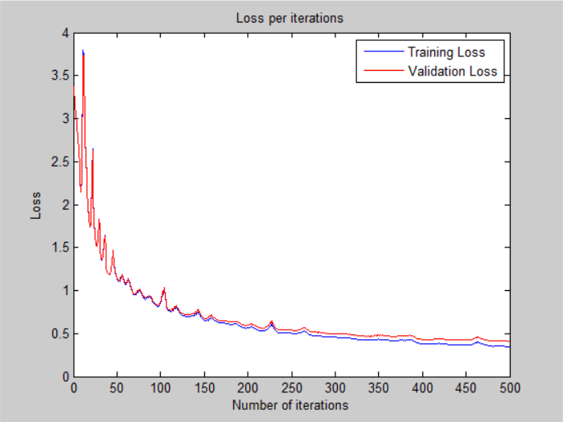
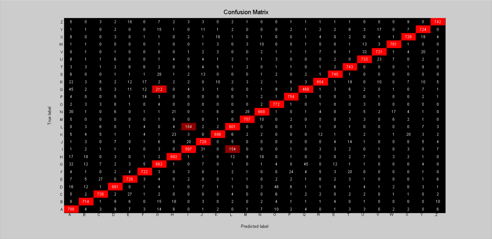

# Deeper Neural Network - v2

## Architecture:

- 1 input layer (784 units)
- 1 hidden layer (512 units, leakyrelu activation)
- 1 hidden layer (128 units, leakyrelu activation)
- 1 output layer (26 units, softmax activation)

## Loss:

## Accuracy:

- 89.25 % -- Training accuracy
- 87.36 % -- Validation accuracy
- 87.65 % -- Test accuracy

