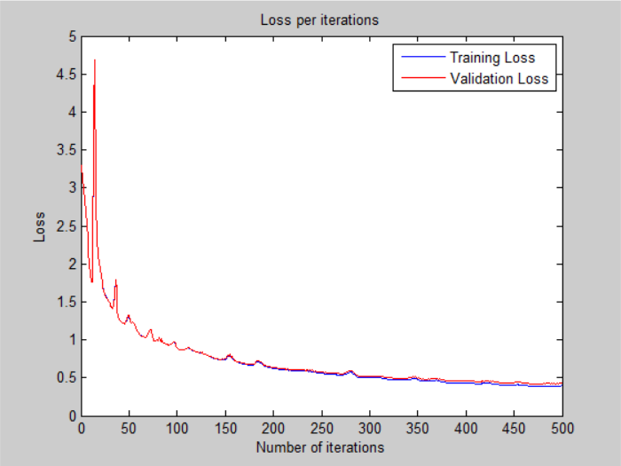
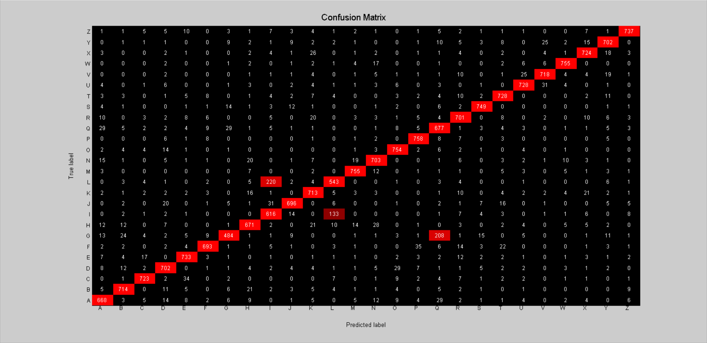

# Deeper Neural Network - v2

## Architecture:

- 1 input layer (784 units)
- 1 hidden layer (512 units, mish activation)
- 1 hidden layer (128 units, mish activation)
- 1 output layer (26 units, softmax activation)

## Loss:

## Accuracy:

- 88.34 % -- Training accuracy
- 87.37 % -- Validation accuracy
- 87.24 % -- Test accuracy

