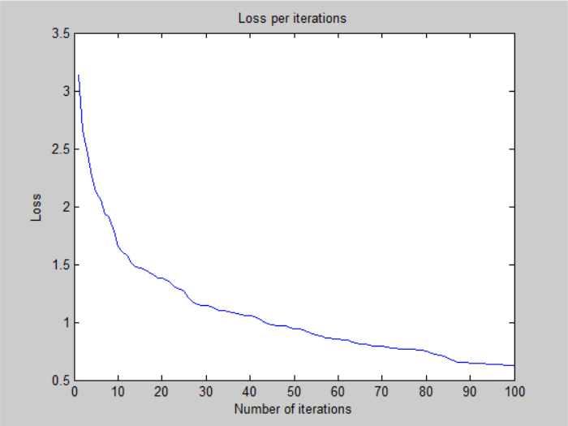
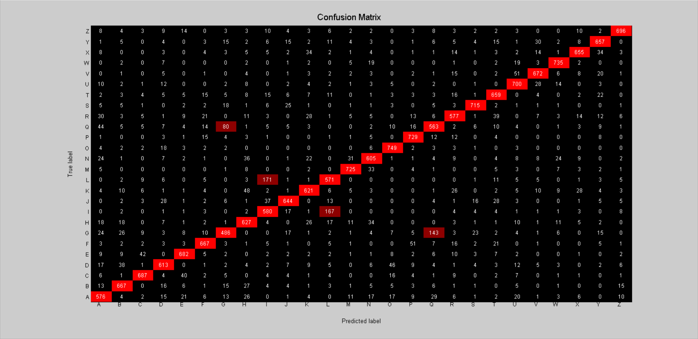

# Deeper Neural Network - v2

## Architecture:

- 1 input layer (784 units)
- 1 hidden layer (128 units, relu activation)
- 1 hidden layer (128 units, relu activation)
- 1 output layer (26 units, softmax activation)

## Training time: 

- 100 iterations for ~7 minutes (CPU)
- 4.2s per iteration on average

## Loss:

- 6.242976e-01 -- Categorical Cross-Entropy Loss

## Accuracy:

- 81.80 % -- Training accuracy
- 81.05 % -- Test accuracy

