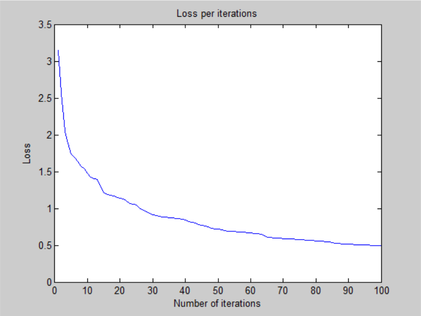

# Deeper Neural Network - v2

## Architecture:

- 1 input layer (784 units)
- 1 hidden layer (256 units, relu activation)
- 1 hidden layer (256 units, relu activation)
- 1 output layer (26 units, softmax activation)

## Training time: 

- 100 iterations for ~12 minutes (CPU)
- 7.2s per iteration on average

## Loss:

- 4.923304e-01 -- Categorical Cross-Entropy Loss

## Accuracy:

- 85.67 % -- Training accuracy
- 84.77 % -- Test accuracy

