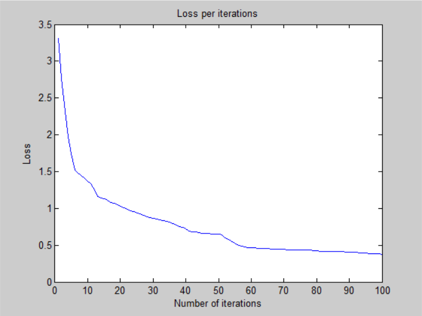
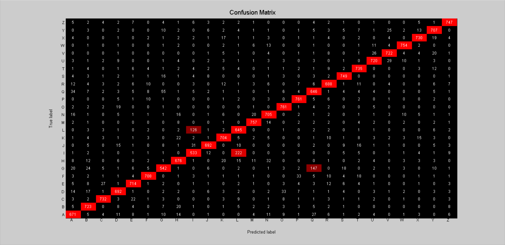

# Deeper Neural Network - v2

## Architecture:

- 1 input layer (784 units)
- 1 hidden layer (512 units, relu activation)
- 1 hidden layer (512 units, relu activation)
- 1 output layer (26 units, softmax activation)

## Training time: 

- 100 iterations for ~47 minutes (CPU)
- 28.2s per iteration on average

## Loss:

- 3.786116e-01 -- Categorical Cross-Entropy Loss

## Accuracy:

- 88.97 % -- Training accuracy
- 87.57 % -- Test accuracy

