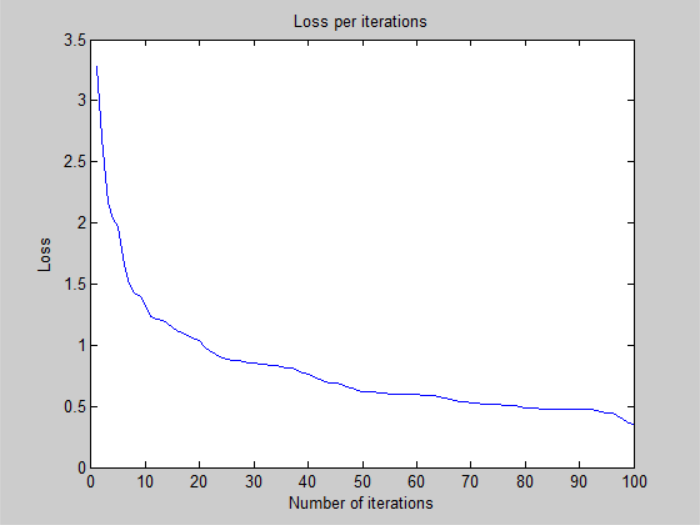
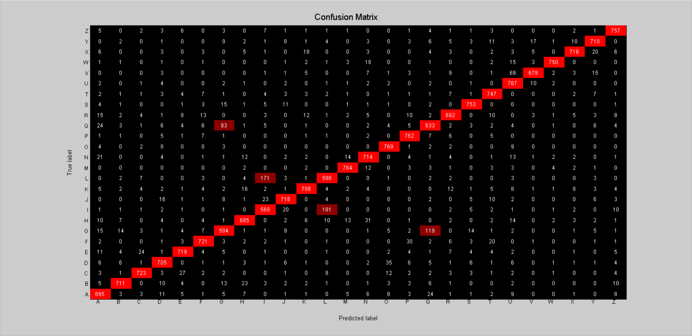

# Neural Network - v2

## Training time: 

- 100 iterations for ~26 minutes (CPU)
- 15.6s per iteration on average

## Loss: 

- 3.501554e-01 -- Categorical Cross-Entropy Loss

## Accuracy:

- 90.11 % -- Training accuracy
- 88.27 % -- Test accuracy

