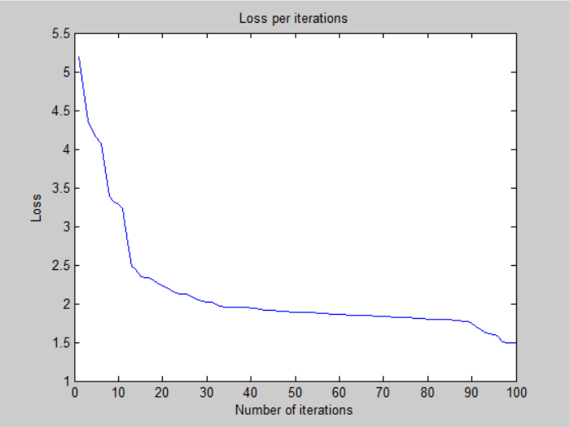
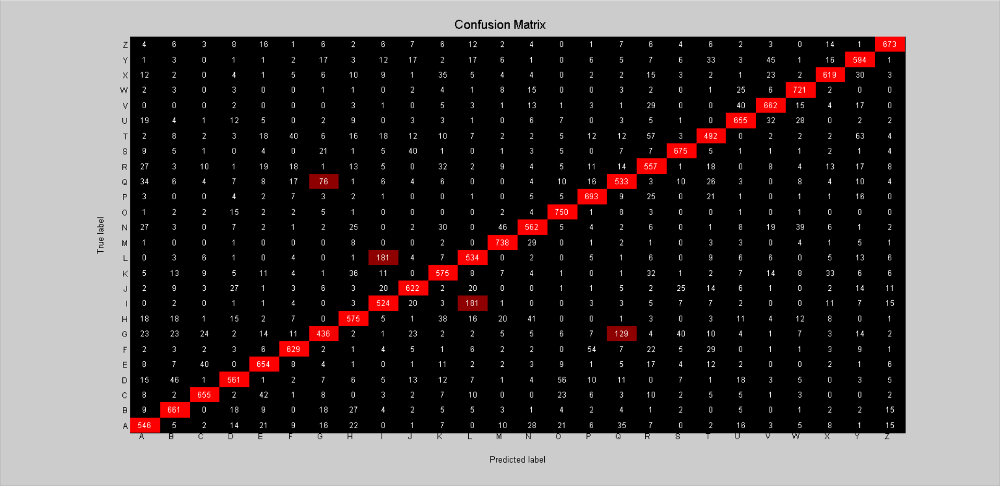

# Neural Network - v1

## Training time: 

- 100 iterations for ~54 minutes (CPU)
- 32.4s per iteration on average

## Loss:

- 1.490939e+00 -- Binary Cross-Entropy Loss

## Accuracy:

- 76.94 % -- Training accuracy
- 76.42 % -- Test accuracy

