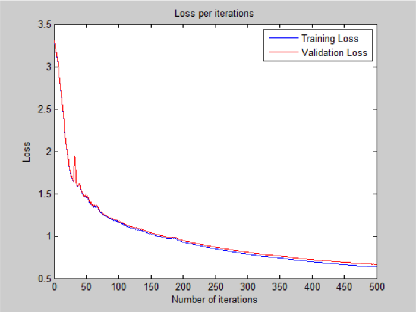

# Neural Network - v1

## Architecture:

- 1 input layer (784 units)
- 1 hidden layer (64 units, leakyrelu activation)
- 1 output layer (26 units, softmax activation)

## Loss:

## Accuracy:

- 81.64 % -- Training accuracy
- 80.91 % -- Validation accuracy
- 80.96 % -- Test accuracy

