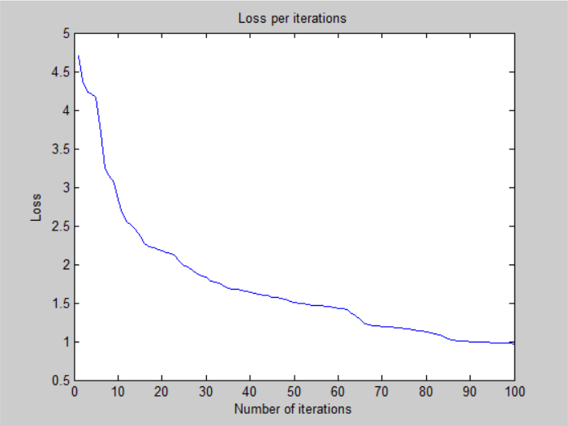
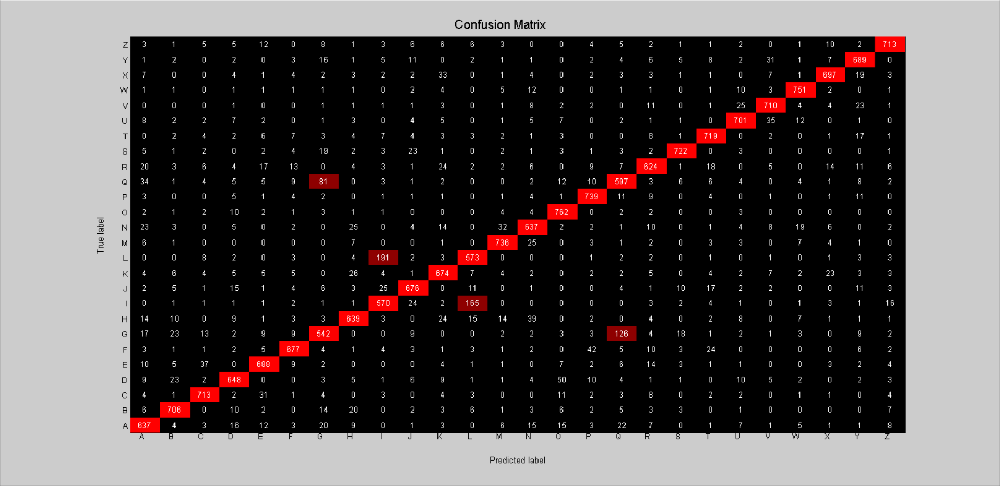

# Neural Network - v1

# Architecture:

- 1 input layer (784 units)
- 1 hidden layer (128 units, sigmoid activation)
- 1 output layer (26 units, sigmoid activation)

## Training time: 

- 100 iterations for ~13 minutes (CPU)
- 7.8s per iteration on average

## Loss:

- 9.704692e-01 -- Binary Cross-Entropy Loss

## Accuracy:

- 85.05 % -- Training accuracy
- 84.33 % -- Test accuracy

