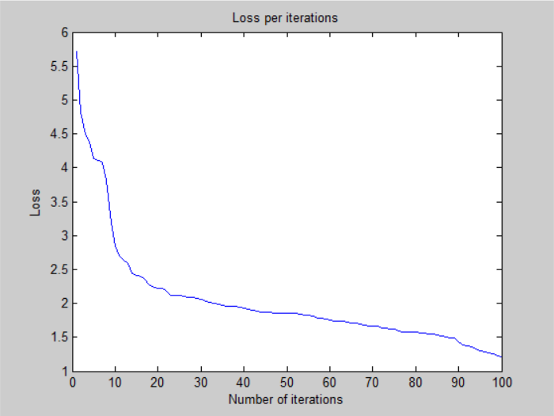
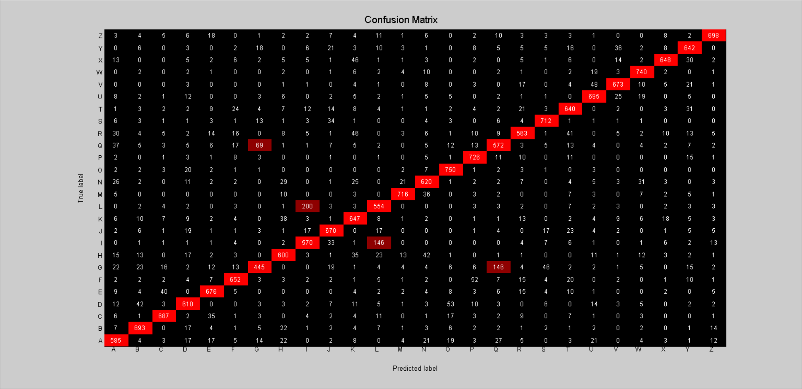

# Neural Network - v1

# Architecture: 

- 1 input layer (784 units)
- 1 hidden layer (512 units, sigmoid activation)
- 1 output layer (26 units, sigmoid activation)

## Training time: 

- 100 iterations for ~38 minutes (CPU)
- 22.8s per iteration on average

## Loss:

- 1.215205e+00 -- Binary Cross-Entropy Loss

## Accuracy:

- 81.22 %-- Training accuracy
- 80.69 % -- Test accuracy

