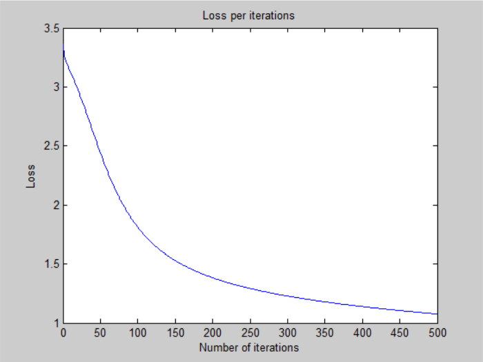
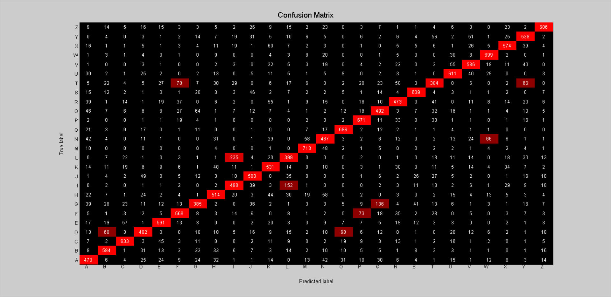

# Neural Network - v1

## Architecture:

- 1 input layer (784 units)
- 1 hidden layer (128 units, sigmoid activation)
- 1 output layer (26 units, softmax activation)

## Training time: 

- 500 iterations for ~22 minutes (CPU)
- 2.64s per iteration on average

## Loss:

- 1.076067e+00 -- Categorical Cross-Entropy Loss

## Accuracy:

- 69.27 % -- Training accuracy
- 69.22 % -- Test accuracy

