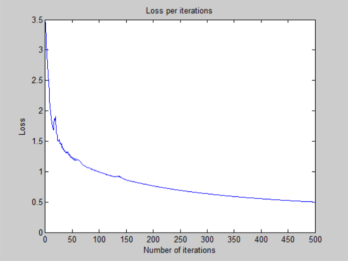
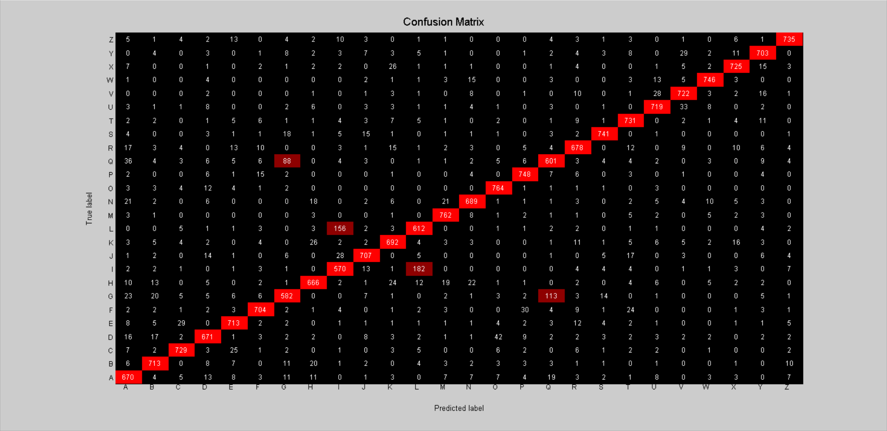

# Neural Network - v2

# Architecture:

- 1 input layer (784 units)
- 1 hidden layer (256 units, relu activation)
- 1 output layer (26 units, softmax activation)

## Training time: 

- 100 iterations for ~13 minutes (CPU)
- 7.8s per iteration on average

## Loss: 

- 4.059525e-01 -- Categorical Cross-Entropy Loss

## Accuracy:

- 88.15 % -- Training accuracy
- 86.99 % -- Test accuracy

