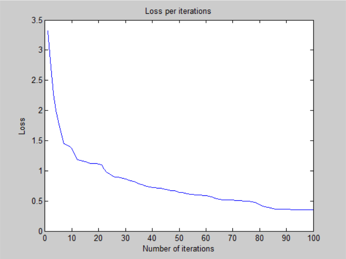
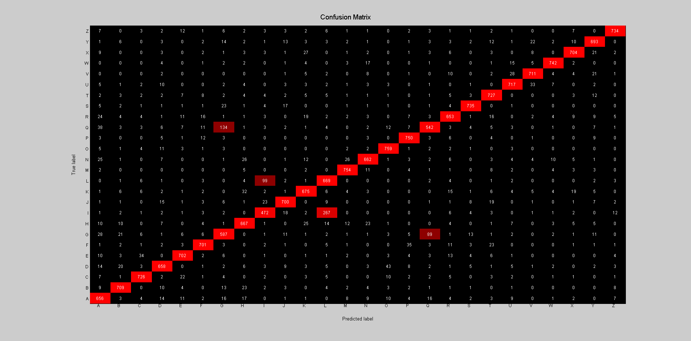

# Neural Network - v2

## Architecture:

- 1 input layer (784 units)
- 1 hidden layer (512 units, relu activation)
- 1 output layer (26 units, softmax activation)

## Training time: 

- 100 iterations for ~27 minutes (CPU)
- 16.2s per iteration on average

## Loss: 

- 3.524869e-01 -- Categorical Cross-Entropy Loss

## Accuracy:

- 89.69 % -- Training accuracy
- 88.03 % -- Test accuracy

