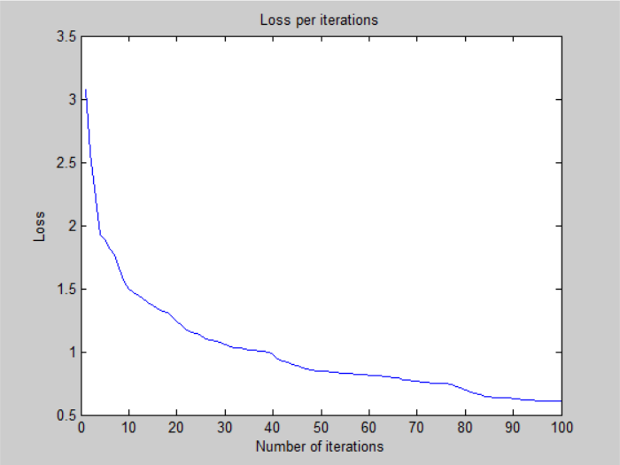
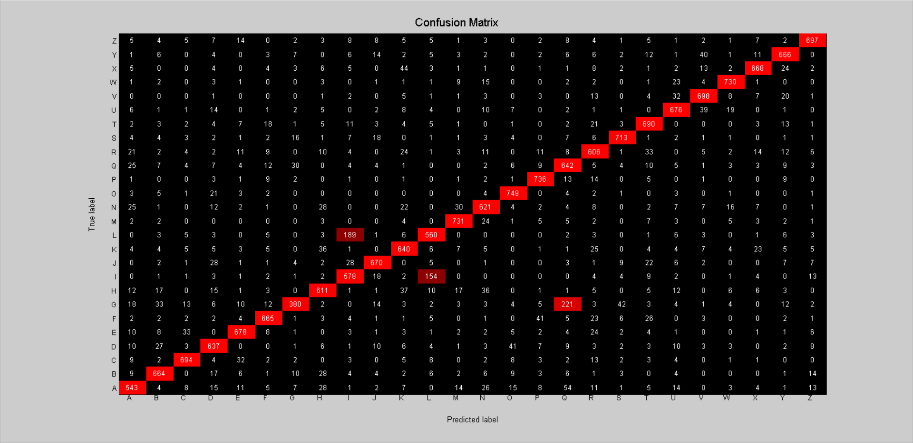

# Neural Network - v2

## Architecture:

- 1 input layer (784 units)
- 1 hidden layer (64 units, relu activation)
- 1 output layer (26 units, softmax activation)

## Training time: 

- 500 iterations for ~26 minutes (CPU)
- 3.12s per iteration on average

## Loss: 

- 6.227792e-01 -- Categorical Cross-Entropy Loss

## Accuracy:

- 82.11 % -- Training accuracy
- 81.46 % -- Test accuracy

