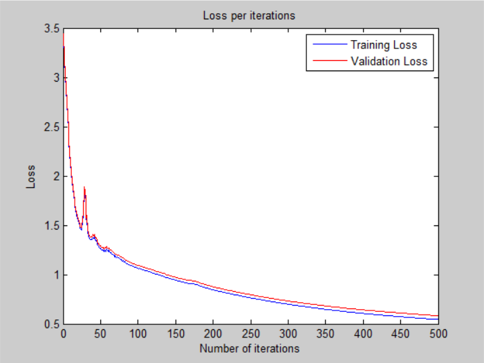
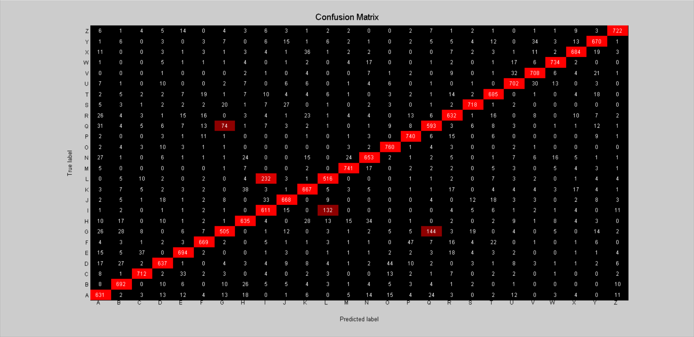

# Neural Network - v3

## Architecture:

- 1 input layer (784 units)
- 1 hidden layer (256 units, swish activation)
- 1 output layer (26 units, softmax activation)

## Loss:

## Accuracy:

- 84.77 % -- Training accuracy
- 83.85 % -- Validation accuracy
- 83.55 % -- Test accuracy

