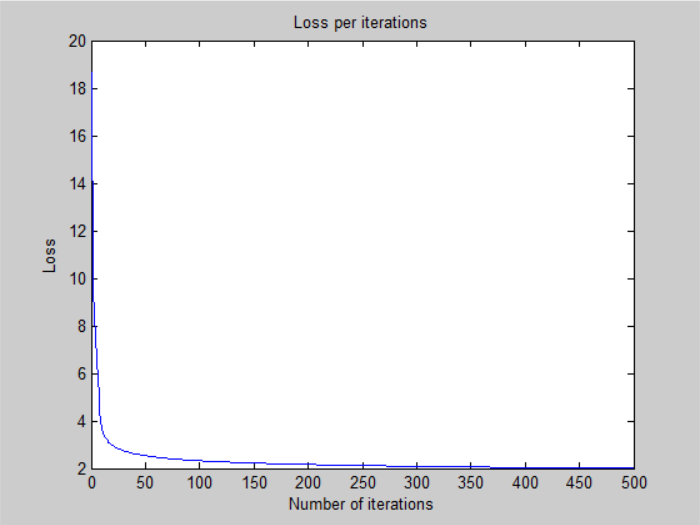
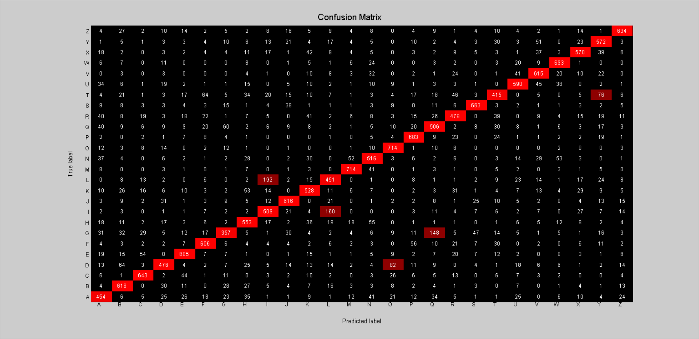

# Perceptron

## Architecture:

- 1 input layer (784 units)
- 1 output layer (26 units, sigmoid activation)

## Loss:

## Accuracy:

- 68.99 % -- Training accuracy
- 68.15 % -- Validation accuracy
- 68.66 % -- Test accuracy

