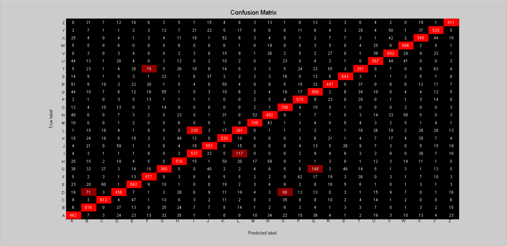

# Perceptron

# Architecture:

- 1 input layer (784 units)
- 1 output layer (26 units, sigmoid activation)

## Training time: 

- 100 iterations for ~3 minutes (CPU)
- 1.8s per iteration on average

## Loss:

- 1.790946e+00 -- Binary Cross-Entropy Loss

## Accuracy:

- 71.60 % -- Training accuracy
- 71.06 % -- Test accuracy

