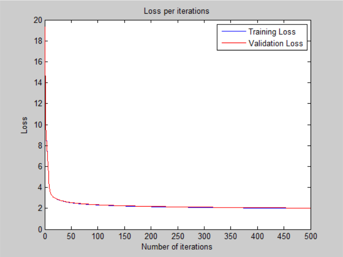

# Perceptron

## Architecture:

- 1 input layer (784 units)
- 1 output layer (26 units, sigmoid activation)

## Training time: 

- 500 iterations for ~17 minutes (CPU)
- 2.04s per iteration on average

## Loss:

- 2.002057e+00 -- Binary Cross-Entropy Loss

## Accuracy:

- 68.88 % -- Training accuracy
- 68.72 % -- Test accuracy

