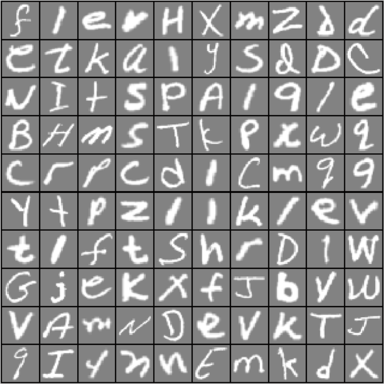
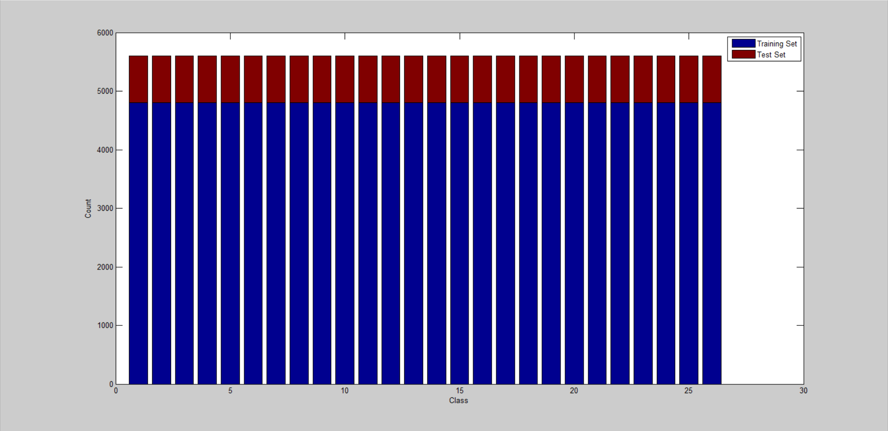
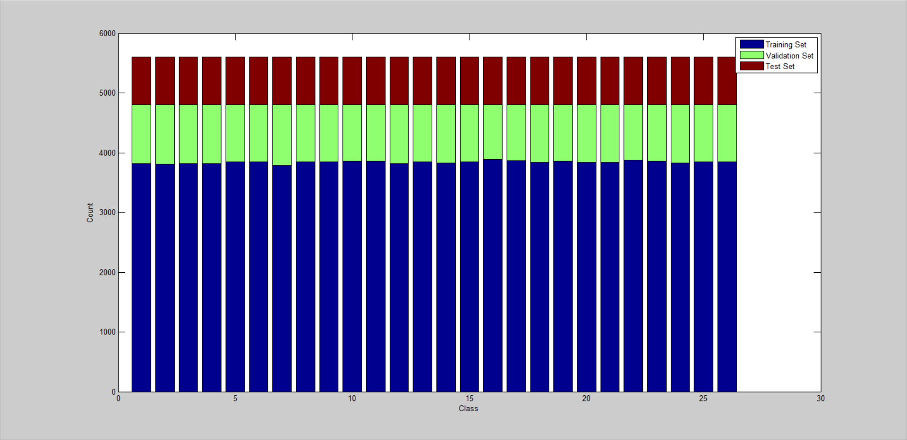

# Letter-Recognition-Matlab

## Dataset:

- Source: https://www.nist.gov/itl/products-and-services/emnist-dataset

### Sample:

### Data Distribution:

### Train - Val - Test Distribution:

## Available models:

- [Perceptron:](Perceptron)

| Model              |  Input Layer  | Output Layer                        | Total Parameters | No. Iterations | Training Accuracy | Validation Accuracy | Test Accuracy |
|--------------------|:-------------:|:-----------------------------------:|:----------------:|:--------------:|:-----------------:|:-------------------:|:-------------:|
| Perceptron_sigmoid |   784 units   |   26 units    Sigmoid activation |      20,410      |       500      |      68.99 %      |       68.15 %       |    68.66 %    |
| Perceptron_softmax |   784 units   |   26 units    Softmax activation |      20,410      |       500      |      70.15 %      |       69.76 %       |    69.88 %    |

- [Neural Network - v1:](Neural_Network_v1)

| Model                   |  Input Layer  | Hidden Layer                           | Output Layer                        | Total Parameters | No. Iterations | Training Accuracy | Validation Accuracy | Test Accuracy |
|-------------------------|:-------------:|:--------------------------------------:|:-----------------------------------:|:----------------:|:--------------:|:-----------------:|:-------------------:|:-------------:|
| NN_sigmoid_softmax_64   |   784 units   |   64 units    Sigmoid activation    |   26 units    Softmax activation |      51,930      |       500      |      67.95 %      |      68.27 %        |    67.81 %    |
| NN_tanh_softmax_64      |   784 units   |   64 units    Tanh activation       |   26 units    Softmax activation |      51,930      |       500      |      79.13 %      |      78.97 %        |    78.53 %    |
| NN_relu_softmax_64      |   784 units   |   64 units    ReLU activation       |   26 units    Softmax activation |      51,930      |       500      |      82.12 %      |      81.98 %        |    81.74 %    |
| NN_leakyrelu_softmax_64 |   784 units   |   64 units    Leaky ReLU activation |   26 units    Softmax activation |      51,930      |       500      |      81.64 %      |      81.91 %        |    80.96 %    |
| NN_swish_softmax_64     |   784 units   |   64 units    Swish activation      |   26 units    Softmax activation |      51,930      |       500      |      81.77 %      |      80.86 %        |    80.92 %    |
| NN_mish_softmax_64      |   784 units   |   64 units    Mish activation       |   26 units    Softmax activation |      51,930      |       500      |      82.31 %      |      81.85 %        |    81.75 %    |

- [Neural Network - v2:](Neural_Network_v2)

| Model                    |  Input Layer  | Hidden Layer                           | Output Layer                        | Total Parameters | No. Iterations | Training Accuracy | Validation Accuracy | Test Accuracy |
|--------------------------|:-------------:|:--------------------------------------:|:-----------------------------------:|:----------------:|:--------------:|:-----------------:|:-------------------:|:-------------:|
| NN_relu_softmax_128      |   784 units   |  128 units    ReLU activation       |   26 units    Softmax activation |     103,834      |       500      |      84.06 %      |      83.37 %        |    83.19 %    |
| NN_leakyrelu_softmax_128 |   784 units   |  128 units    Leaky ReLU activation |   26 units    Softmax activation |     103,834      |       500      |      84.14 %      |      82.67 %        |    82.95 %    |
| NN_swish_softmax_128     |   784 units   |  128 units    Swish activation      |   26 units    Softmax activation |     103,834      |       500      |      83.71 %      |      82.84 %        |    83.02 %    |
| NN_mish_softmax_128      |   784 units   |  128 units    Mish activation       |   26 units    Softmax activation |     103,834      |       500      |      83.78 %      |      83.05 %        |    83.14 %    |

- [Neural Network - v3:](Neural_Network_v3)

| Model                    |  Input Layer  | Hidden Layer                           | Output Layer                        | Total Parameters | No. Iterations | Training Accuracy | Validation Accuracy | Test Accuracy |
|--------------------------|:-------------:|:--------------------------------------:|:-----------------------------------:|:----------------:|:--------------:|:-----------------:|:-------------------:|:-------------:|
| NN_relu_softmax_256      |   784 units   |  256 units    ReLU activation       |   26 units    Softmax activation |     207,642      |       500      |      85.57 %      |      85.18 %        |    84.60 %    |
| NN_leakyrelu_softmax_256 |   784 units   |  256 units    Leaky ReLU activation |   26 units    Softmax activation |     207,642      |       500      |      85.37 %      |      84.70 %        |    84.15 %    |
| NN_swish_softmax_256     |   784 units   |  256 units    Swish activation      |   26 units    Softmax activation |     207,642      |       500      |      84.77 %      |      83.85 %        |    83.55 %    |
| NN_mish_softmax_256      |   784 units   |  256 units    Mish activation       |   26 units    Softmax activation |     207,642      |       500      |      85.16 %      |      84.43 %        |    84.30 %    |

- [Neural Network - v4:](Neural_Network_v4)

| Model                    |  Input Layer  | Hidden Layer                           | Output Layer                        | Total Parameters | No. Iterations | Training Accuracy | Validation Accuracy | Test Accuracy |
|--------------------------|:-------------:|:--------------------------------------:|:-----------------------------------:|:----------------:|:--------------:|:-----------------:|:-------------------:|:-------------:|
| NN_relu_softmax_512      |   784 units   |  512 units    ReLU activation       |   26 units    Softmax activation |     415,258      |       500      |      87.03 %      |      86.02 %        |    85.51 %    |
| NN_leakyrelu_softmax_512 |   784 units   |  512 units    Leaky ReLU activation |   26 units    Softmax activation |     415,258      |       500      |      86.79 %      |      85.00 %        |    85.30 %    |
| NN_swish_softmax_512     |   784 units   |  512 units    Swish activation      |   26 units    Softmax activation |     415,258      |       500      |      85.20 %      |      83.89 %        |    84.13 %    |
| NN_mish_softmax_512      |   784 units   |  512 units    Mish activation       |   26 units    Softmax activation |     415,258      |       500      |      86.21 %      |      85.65 %        |    85.01 %    |

- [Deeper Neural Network - v1:](Deeper_Neural_Network_v1)

| Model                       |  Input Layer  | Hidden Layer 1                         | Hidden Layer 2                         | Output Layer                        | Total Parameters | No. Iterations | Training Accuracy | Validation Accuracy | Test Accuracy |
|-----------------------------|:-------------:|:--------------------------------------:|:--------------------------------------:|:-----------------------------------:|:----------------:|:--------------:|:-----------------:|:-------------------:|:-------------:|
| NN_relu_softmax_512_64      |   784 units   |  512 units    ReLU activation       |   64 units    ReLU activation       |   26 units    Softmax activation |     436,442      |       500      |      88.46 %      |      86.85 %        |    86.71 %    |
| NN_leakyrelu_softmax_512_64 |   784 units   |  512 units    Leaky ReLU activation |   64 units    Leaky ReLU activation |   26 units    Softmax activation |     436,442      |       500      |      88.84 %      |      87.31 %        |    87.28 %    |
| NN_swish_softmax_512_64     |   784 units   |  512 units    Swish activation      |   64 units    Swish activation      |   26 units    Softmax activation |     436,442      |       500      |      87.58 %      |      86.68 %        |    86.42 %    |
| NN_mish_softmax_512_64      |   784 units   |  512 units    Mish activation       |   64 units    Mish activation       |   26 units    Softmax activation |     436,442      |       500      |      87.94 %      |      87.17 %        |    87.01 %    |

- [Deeper Neural Network - v2:](Deeper_Neural_Network_v2)

| Model                        |  Input Layer  | Hidden Layer 1                         | Hidden Layer 2                         | Output Layer                        | Total Parameters | No. Iterations | Training Accuracy | Validation Accuracy | Test Accuracy |
|------------------------------|:-------------:|:--------------------------------------:|:--------------------------------------:|:-----------------------------------:|:----------------:|:--------------:|:-----------------:|:-------------------:|:-------------:|
| NN_relu_softmax_512_128      |   784 units   |  512 units    ReLU activation       |  128 units    ReLU activation       |   26 units    Softmax activation |     470,938      |       500      |      89.40 %      |      88.05 %        |    87.56 %    |
| NN_leakyrelu_softmax_512_128 |   784 units   |  512 units    Leaky ReLU activation |  128 units    Leaky ReLU activation |   26 units    Softmax activation |     470,938      |       500      |      89.25 %      |      87.36 %        |    87.65 %    |
| NN_swish_softmax_512_128     |   784 units   |  512 units    Swish activation      |  128 units    Swish activation      |   26 units    Softmax activation |     470,938      |       500      |      87.86 %      |      87.02 %        |    86.81 %    |
| NN_mish_softmax_512_128      |   784 units   |  512 units    Mish activation       |  128 units    Mish activation       |   26 units    Softmax activation |     470,938      |       500      |      88.34 %      |      87.37 %        |    87.24 %    |

- [Deeper Neural Network - v3:](Deeper_Neural_Network_v3)

| Model                        |  Input Layer  | Hidden Layer 1                         | Hidden Layer 2                         | Output Layer                        | Total Parameters | No. Iterations | Training Accuracy | Validation Accuracy | Test Accuracy |
|------------------------------|:-------------:|:--------------------------------------:|:--------------------------------------:|:-----------------------------------:|:----------------:|:--------------:|:-----------------:|:-------------------:|:-------------:|
| NN_relu_softmax_512_256      |   784 units   |  512 units    ReLU activation       |  256 units    ReLU activation       |   26 units    Softmax activation |     539,930      |       500      |      89.98 %      |      88.10 %        |    88.29 %    |
| NN_leakyrelu_softmax_512_256 |   784 units   |  512 units    Leaky ReLU activation |  256 units    Leaky ReLU activation |   26 units    Softmax activation |     539,930      |       500      |      89.99 %      |      88.34 %        |    88.31 %    |
| NN_swish_softmax_512_256     |   784 units   |  512 units    Swish activation      |  256 units    Swish activation      |   26 units    Softmax activation |     539,930      |       500      |      87.56 %      |      86.71 %        |    86.44 %    |
| NN_mish_softmax_512_256      |   784 units   |  512 units    Mish activation       |  256 units    Mish activation       |   26 units    Softmax activation |     539,930      |       500      |      88.74 %      |      87.69 %        |    87.50 %    |