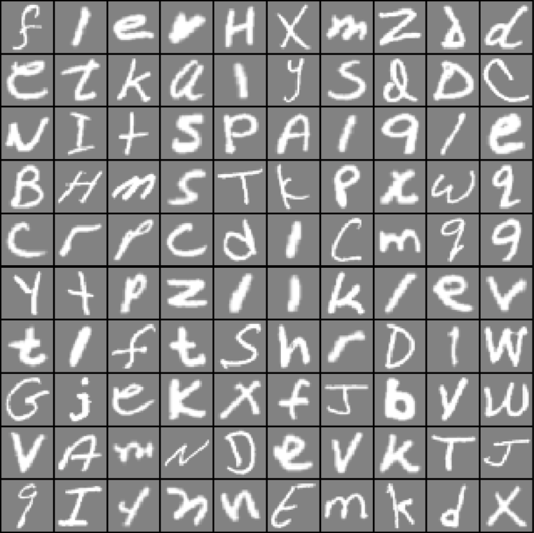

# Letter-Recognition-Matlab

This repository compare models used to recognize letters from images via performance (training time, accuracy). 
The models are coded from scratch in Matlab programming language.

## Dataset:

- Source: https://www.nist.gov/itl/products-and-services/emnist-dataset

### Data Distribution:

### Sample:

## Available models:

- [Perceptron:](Perceptron)

| Model              |  Input Layer  | Output Layer                        | Total Parameters | No. Iterations |  Duration   | Training Accuracy | Test Accuracy |
|--------------------|:-------------:|:-----------------------------------:|:----------------:|:--------------:|:-----------:|:-----------------:|:-------------:|
| Perceptron_sigmoid |   784 units   |   26 units    Sigmoid activation |      20,410      |       500      | ~17 minutes |      68.88 %      |    68.72 %    |
| Perceptron_softmax |   784 units   |   26 units    Softmax activation |      20,410      |       500      | ~16 minutes |      70.02 %      |    70.07 %    |

- [Neural Network - v1:](Neural_Network_v1)

| Model                   |  Input Layer  | Hidden Layer                          | Output Layer                        | Total Parameters | No. Iterations |   Duration     | Training Accuracy | Test Accuracy |
|-------------------------|:-------------:|:-------------------------------------:|:-----------------------------------:|:----------------:|:--------------:|:--------------:|:-----------------:|:-------------:|
| NN_sigmoid_softmax_64   |   784 units   |   64 units    Sigmoid activation   |   26 units    Softmax activation |      51,930      |       500      | ~18 minutes    |      68.02 %      |    67.82 %    |
| NN_sigmoid_softmax_128  |   784 units   |   128 units    Sigmoid activation  |   26 units    Softmax activation |     103,834      |       500      | ~22 minutes    |      69.27 %      |    69.22 %    |
| NN_sigmoid_softmax_256  |   784 units   |   256 units    Sigmoid activation  |   26 units    Softmax activation |     207,642      |       500      | ~42 minutes    |      70.14 %      |    69.87 %    |
| NN_sigmoid_softmax_512  |   784 units   |   512 units    Sigmoid activation  |   26 units    Softmax activation |     415,258      |       500      | ~1h 52 minutes |      70.56 %      |    70.63 %    |
| NN_sigmoid_softmax_1024 |   784 units   |   1024 units    Sigmoid activation |   26 units    Softmax activation |     830,490      |       500      | ~4h 55 minutes |      70.57 %      |    70.25 %    |

- [Neural Network - v2:](Neural_Network_v2)

| Model                |  Input Layer  | Hidden Layer                       | Output Layer                        | Total Parameters | No. Iterations |   Duration     | Training Accuracy | Test Accuracy |
|----------------------|:-------------:|:----------------------------------:|:-----------------------------------:|:----------------:|:--------------:|:--------------:|:-----------------:|:-------------:|
| NN_relu_softmax_64   |   784 units   |   64 units    ReLU activation   |   26 units    Softmax activation |      51,930      |       500      | ~26 minutes    |      82.11 %      |    81.46 %    |
| NN_relu_softmax_128  |   784 units   |   128 units    ReLU activation  |   26 units    Softmax activation |     103,834      |       500      | ~34 minutes    |      84.13 %      |    83.18 %    |
| NN_relu_softmax_256  |   784 units   |   256 units    ReLU activation  |   26 units    Softmax activation |     207,642      |       500      | ~52 minutes    |      85.68 %      |    84.60 %    |
| NN_relu_softmax_512  |   784 units   |   512 units    ReLU activation  |   26 units    Softmax activation |     415,258      |       500      | ~1h 21 minutes |      86.98 %      |    85.60 %    |
| NN_relu_softmax_1024 |   784 units   |   1024 units    ReLU activation |   26 units    Softmax activation |     830,490      |       500      | ~2h 16 minutes |      88.07 %      |    86.50 %    |

- [Deeper Neural Network - v1:](Deeper_Neural_Network_v1)

| Model                    |  Input Layer  | Hidden Layer 1                      | Hidden Layer 2                    | Output Layer                        | Total Parameters | No. Iterations |   Duration  | Training Accuracy | Test Accuracy |
|--------------------------|:-------------:|:-----------------------------------:|:---------------------------------:|:-----------------------------------:|:----------------:|:--------------:|:-----------:|:-----------------:|:-------------:|
| NN_relu_softmax_1024_64  |   784 units   |   1024 units    ReLU activation  |   64 units    ReLU activation  |   26 units    Softmax activation |     871,130      |       500      | ~2h 49 minutes |      89.32 %      |    87.74 %    |
| NN_relu_softmax_1024_128 |   784 units   |   1024 units    ReLU activation  |   128 units    ReLU activation |   26 units    Softmax activation |     938,394      |       500      | ~2h 12 minutes |      90.19 %      |    88.42 %    |
| NN_relu_softmax_1024_256 |   784 units   |   1024 units    ReLU activation  |   256 units    ReLU activation |   26 units    Softmax activation |     1,072,922    |       500      | ~3h 8 minutes  |      90.53 %      |    88.44 %    |

- [Deeper Neural Network - v2:](Deeper_Neural_Network_v2)

| Model                    |  Input Layer  | Hidden Layer 1                      | Hidden Layer 2                    | Hidden Layer 3                    | Output Layer                        | Total Parameters | No. Iterations |   Duration  | Training Accuracy | Test Accuracy |
|--------------------------|:-------------:|:-----------------------------------:|:---------------------------------:|:---------------------------------:|:-----------------------------------:|:----------------:|:--------------:|:-----------:|:-----------------:|:-------------:|
| NN_relu_softmax_1024_256 |   784 units   |   1024 units    ReLU activation  |   256 units    ReLU activation |   64 units    ReLU activation  |   26 units    Softmax activation |     1,084,378    |       500      | ~3h 9 minutes  |      91.08 %      |    88.99 %    |